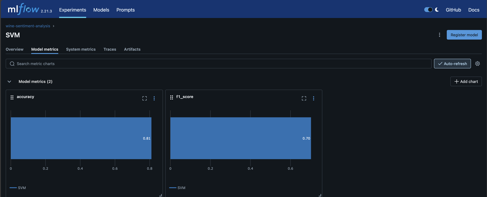

# MLOps1 - CEIA - FIUBA

### Integrantes:
Nicolás Werner (a1825)
Pablo Menardi (a1814)

### Dataset
Utilizamos el dataset que se uso para el trabajo final de AM 1 llamado wine profiles. Que se puede encontrar en la carpeta `data`

# Implementación del DAG para Análisis de Sentimiento en reviews de Vinos

Este proyecto implementa un pipeline de MLOps para análisis en reviews de vinos utilizando Apache Airflow. El DAG realiza las siguientes tareas:

1. **Carga de datos**: Importa el dataset de perfiles de vinos con reviews y metadatos.

2. **Cálculo de subjetividad**: Analiza cada reseña utilizando TextBlob para determinar su nivel de subjetividad, complementando el análisis de polaridad.

3. **Preparación de características**: Vectoriza el texto de las reviews utilizando TF-IDF para preparar los datos para poder hacer el entrenamiento de los modelos.

4. **Entrenamiento de modelos**: Entrena y compara diferentes modelos de análisis de sentimiento:
   - Método baseline basado en polaridad
   - Regresión Logística
   - SVM (Support Vector Machine)
   
   Y los resultados los registramos en MLflow para seguimiento y comparación.

5. **Motor de recomendación**: Implementa un sistema de recomendación de vinos basado en:
   - Similitud de atributos sensoriales
   - Sentimiento de las reviews
   - Preferencias del usuario

Aca unas imagenes de los resultados obtenidos:

El DAG que se creo para el entrenamiento se encuentra en `airflow/dags/wine_sentiment_analysis_dag.py`

# Pasos a seguir

La idea es luego continuar con la busqueda de hiperparametros en MLflow y ademas generar el servicio de RESTAPI que para esta primera entrega no llegamos.